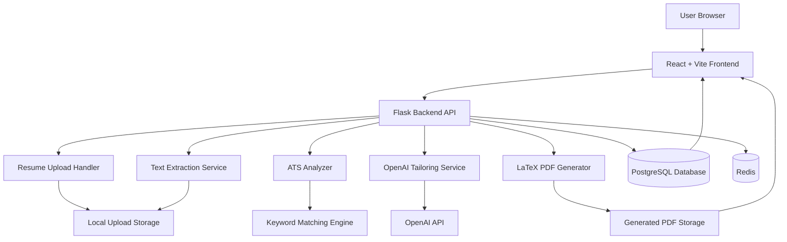
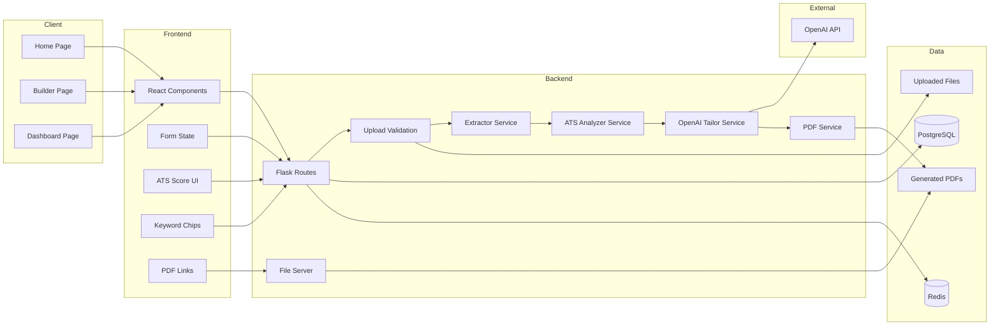
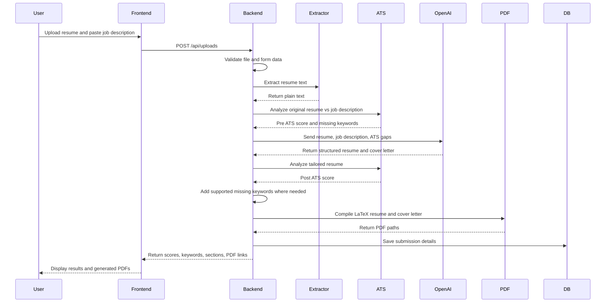
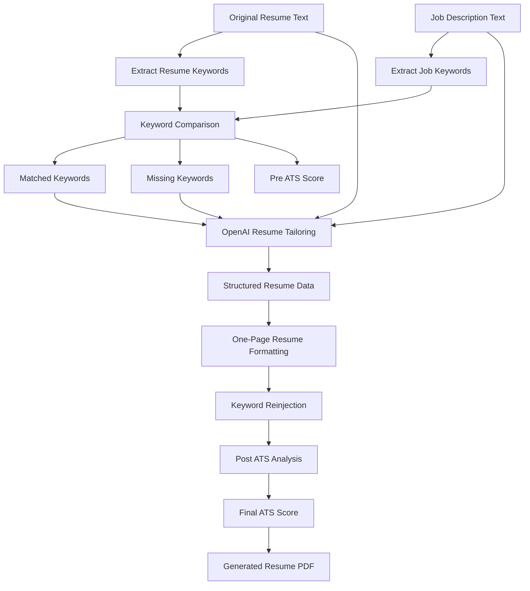

# Talyrd — AI Resume Tailoring & ATS Optimization Platform

Talyrd is a full-stack AI-powered resume tailoring platform that helps users generate job-specific, ATS-friendly resumes and cover letters.

Users upload a resume, paste a job description, and Talyrd analyzes keyword gaps, improves resume alignment, generates a structured one-page LaTeX resume PDF, and creates a matching cover letter.

Talyrd is built as an end-to-end production-style software project with a React frontend, Flask backend, PostgreSQL database, Redis infrastructure foundation, OpenAI integration, resume parsing, ATS analysis, and LaTeX-based PDF generation.

---

## Table of Contents

- [Project Overview](#project-overview)
- [Problem Talyrd Solves](#problem-talyrd-solves)
- [Core Features](#core-features)
- [Tech Stack](#tech-stack)
- [High-Level Architecture](#high-level-architecture)
- [Detailed Architecture](#detailed-architecture)
- [Workflow](#workflow)
- [ATS Optimization Flow](#ats-optimization-flow)
- [Resume Generation Flow](#resume-generation-flow)
- [Frontend Pages](#frontend-pages)
- [Backend Services](#backend-services)
- [Database Design](#database-design)
- [API Endpoints](#api-endpoints)
- [PDF Generation](#pdf-generation)
- [OpenAI Integration](#openai-integration)
- [Why Talyrd Is Useful](#why-talyrd-is-useful)
- [Advantages of Talyrd](#advantages-of-talyrd)
- [Local Setup](#local-setup)
- [Docker Services](#docker-services)
- [Project Structure](#project-structure)
- [Environment Variables](#environment-variables)
- [How to Use Talyrd](#how-to-use-talyrd)
- [Troubleshooting](#troubleshooting)
- [Security and Privacy Notes](#security-and-privacy-notes)
- [Current Limitations](#current-limitations)
- [Future Improvements](#future-improvements)
- [Portfolio Value](#portfolio-value)
- [Summary](#summary)

---

## Project Overview

Talyrd is an AI Resume Tailoring and ATS Optimization Platform.

The system allows a user to:

1. Upload an existing resume.
2. Paste a target job description.
3. Extract text from the uploaded resume.
4. Analyze resume-job keyword alignment.
5. Generate a tailored resume using OpenAI.
6. Improve ATS keyword coverage.
7. Produce a clean one-page LaTeX resume PDF.
8. Generate a matching cover letter.
9. View previous submissions from a dashboard.

Talyrd is designed to simulate how a real resume optimization SaaS product could work.

---

## Problem Talyrd Solves

Job seekers often apply to many jobs with the same generic resume. This causes problems:

- The resume may not match the job description.
- Important ATS keywords may be missing.
- Recruiters may not quickly see relevant skills.
- Manually tailoring each resume takes too much time.
- AI-generated resumes can become too generic or untruthful.
- Formatting resumes manually is difficult and inconsistent.

Talyrd solves this by combining:

- Resume parsing
- Job description analysis
- ATS keyword gap detection
- AI-based resume rewriting
- One-page resume formatting
- LaTeX PDF generation
- Submission history tracking

---

## Core Features

### Resume Upload

Talyrd supports multiple resume file formats:

- PDF
- DOCX
- TXT
- TEX

### Text Extraction

The backend extracts plain text from the uploaded resume so it can be analyzed and rewritten.

### ATS Analysis

Talyrd compares the resume against the job description and calculates:

- Pre-tailoring ATS score
- Post-tailoring ATS score
- Matched keywords
- Missing keywords
- Resume keywords
- Job description keywords
- Recommendations

### OpenAI Resume Tailoring

Talyrd uses OpenAI to generate structured resume content based on:

- Original resume
- Job description
- Missing keywords
- Target role
- ATS analysis

### One-Page Resume Generation

The system generates a compact one-page resume with required sections:

- Professional Summary
- Technical Skills
- Professional Experience
- Projects
- Education

### Cover Letter Generation

Talyrd also generates a matching cover letter for the target role.

### PDF Generation

Talyrd uses LaTeX templates and `pdflatex` to generate professional PDF files.

### Dynamic Frontend

The frontend includes:

- Animated landing page
- Builder page
- Dashboard page
- Parallax effects
- ATS score ring
- Keyword chips
- Submission cards
- PDF links

### Submission Dashboard

Users can view previous generations, inspect ATS scores, and reopen generated PDFs.

---

## Tech Stack

| Layer | Technology |
|---|---|
| Frontend | React.js, Vite, JavaScript, CSS |
| Backend | Python, Flask |
| Database | PostgreSQL |
| Cache / Queue Foundation | Redis |
| AI Provider | OpenAI API |
| Resume Parsing | pdfplumber, python-docx |
| PDF Generation | LaTeX, pdflatex, Jinja2 |
| Containerization | Docker, Docker Compose |
| API Style | REST API |
| Storage | Local Docker volume / backend storage |
| Styling | Custom CSS, glassmorphism UI, animations, parallax effects |

---

## High-Level Architecture

GitHub automatically renders this Mermaid diagram as an architecture image.



---

## Detailed Architecture



---

## Workflow



---

## ATS Optimization Flow



---

## Resume Generation Flow

Talyrd uses a structured resume generation approach.

The OpenAI service returns JSON with:

```json
{
  "summary": "Professional summary",
  "skills": {
    "languages": [],
    "backend": [],
    "frontend": [],
    "databases": [],
    "cloud_devops": [],
    "ai_tools": [],
    "practices": []
  },
  "experience": [
    {
      "company": "Company Name",
      "title": "Job Title",
      "location": "City, State",
      "dates": "Date Range",
      "bullets": []
    }
  ],
  "projects": [
    {
      "name": "Project Name",
      "tech_stack": "Tech Stack",
      "bullets": []
    }
  ],
  "education": [
    {
      "school": "University Name",
      "degree": "Degree Name",
      "location": "Location",
      "dates": "Date Range",
      "details": []
    }
  ]
}
```

This structured data is then passed into a LaTeX template to generate a professional PDF resume.

---

## Frontend Pages

### 1. Home Page

The Home page is a dynamic landing page with:

- Animated hero section
- Parallax resume mockup
- Product feature cards
- Workflow explanation
- System status summary

### 2. Builder Page

The Builder page is the main resume generation workflow.

It includes:

- Full name input
- Target role input
- Resume file upload
- Job description textarea
- Loading animation
- ATS score ring
- Matched keywords
- Missing keywords
- Resume section preview
- Resume PDF link
- Cover letter PDF link

### 3. Dashboard Page

The Dashboard page shows previous submissions.

It includes:

- Resume generation history
- ATS score comparison
- Submission cards
- Inspect button
- Resume PDF links

---

## Backend Services

### 1. Flask Routes

Main file:

```text
backend/app/routes.py
```

Responsibilities:

- API routing
- Resume upload handling
- Calling services
- Returning JSON responses
- Serving generated PDF files

### 2. Extractor Service

Main file:

```text
backend/app/services/extractor.py
```

Responsibilities:

- Extract text from PDF
- Extract text from DOCX
- Extract text from TXT
- Extract text from TEX

### 3. ATS Analyzer Service

Main file:

```text
backend/app/services/ats_analyzer.py
```

Responsibilities:

- Extract job keywords
- Extract resume keywords
- Calculate matched keywords
- Calculate missing keywords
- Generate ATS score
- Return recommendations

### 4. OpenAI Tailor Service

Main file:

```text
backend/app/services/openai_tailor.py
```

Responsibilities:

- Create OpenAI prompt payload
- Generate structured resume content
- Generate cover letter
- Preserve resume truthfulness
- Add target keywords
- Enforce one-page constraints

### 5. PDF Service

Main file:

```text
backend/app/services/pdf_service.py
```

Responsibilities:

- Render Jinja2 LaTeX templates
- Escape LaTeX special characters
- Compile `.tex` files with `pdflatex`
- Store generated PDF output

### 6. Database Service

Main file:

```text
backend/app/db.py
```

Responsibilities:

- Connect to PostgreSQL
- Initialize database table
- Add missing columns safely
- Provide database health check

---

## Database Design

Talyrd stores each generation as a submission.

Main table:

```sql
submissions
```

Important fields:

| Column | Purpose |
|---|---|
| id | Unique submission ID |
| full_name | Candidate name |
| target_role | Target job title |
| original_filename | Uploaded resume filename |
| stored_filename | Internal stored filename |
| upload_path | Local path to uploaded resume |
| job_description | Job description text |
| extracted_resume_text | Parsed resume text |
| extracted_char_count | Number of extracted characters |
| extraction_status | Text extraction status |
| pre_ats_score | Score before tailoring |
| post_ats_score | Score after tailoring |
| ats_score | Final ATS score |
| job_keywords | Keywords extracted from job description |
| resume_keywords | Keywords extracted from resume |
| matched_keywords | Keywords found in resume |
| missing_keywords | Keywords still missing |
| recommendations | ATS improvement recommendations |
| tailoring_status | OpenAI tailoring status |
| tailored_resume_text | Final tailored resume text |
| tailored_summary | Resume summary |
| tailored_skills | Resume skills |
| tailored_experience | Resume experience |
| tailored_projects | Resume projects |
| tailored_education | Resume education |
| cover_letter_text | Generated cover letter |
| improvement_summary | Explanation of changes |
| pdf_status | PDF generation status |
| resume_pdf_path | Generated resume PDF path |
| cover_letter_pdf_path | Generated cover letter PDF path |
| created_at | Submission timestamp |

---

## API Endpoints

### Health Check

```http
GET /health
```

Returns basic backend status.

### App Status

```http
GET /api/status
```

Returns:

- App name
- Version
- Backend status
- Database status
- OpenAI configuration status
- PDF generation status

### Upload Resume

```http
POST /api/uploads
```

Accepts:

- full_name
- target_role
- job_description
- resume file

Returns:

- Submission ID
- ATS scores
- Matched keywords
- Missing keywords
- Tailored sections
- Cover letter text
- Resume PDF URL
- Cover letter PDF URL

### List Submissions

```http
GET /api/submissions
```

Returns previous resume generations.

### Get Submission Detail

```http
GET /api/submissions/:id
```

Returns full details for a specific generation.

### Serve PDF File

```http
GET /api/files/:path
```

Serves generated resume and cover letter PDF files.

---

## PDF Generation

Talyrd generates PDFs using LaTeX.

Templates:

```text
backend/app/templates/resume.tex.j2
backend/app/templates/cover_letter.tex.j2
```

Generated files are stored in:

```text
backend/storage/outputs/
```

Why LaTeX?

- Professional typography
- Clean resume layout
- Better control over spacing
- Reliable PDF compilation
- ATS-friendly text-based PDF output
- Better than screenshot-based or image-based resumes

---

## OpenAI Integration

Talyrd uses OpenAI for resume tailoring.

The OpenAI prompt receives:

- Full name
- Target role
- Original resume text
- Job description
- ATS analysis
- Missing keywords
- Resume structure requirements
- One-page constraints

The AI is instructed to:

- Generate a real resume, not plain keyword text
- Preserve company names, roles, dates, and education
- Keep the resume truthful
- Avoid fake experience
- Add job keywords naturally
- Keep the resume one page
- Return structured JSON only

---

## Why Talyrd Is Useful

Talyrd is useful because it combines multiple resume optimization steps into one workflow.

Without Talyrd, users often need to:

1. Read the job description manually.
2. Identify important keywords.
3. Compare those keywords against their resume.
4. Rewrite bullets.
5. Reformat the resume.
6. Create a PDF.
7. Write a cover letter.

Talyrd automates most of that process.

---

## Advantages of Talyrd

### 1. Faster Resume Tailoring

Users can generate a job-specific resume in minutes instead of spending 30–60 minutes manually editing.

### 2. Better ATS Keyword Coverage

Talyrd finds missing keywords and adds relevant ones into the resume structure.

### 3. One-Page Resume Output

The system is designed to generate compact one-page resumes that recruiters can scan quickly.

### 4. Structured Resume Formatting

Talyrd preserves resume sections like:

- Summary
- Skills
- Experience
- Projects
- Education

### 5. Professional PDF Output

LaTeX PDF generation creates a polished resume instead of plain AI-generated text.

### 6. Cover Letter Generation

The platform generates both a tailored resume and a matching cover letter.

### 7. Submission History

Users can revisit previous resume generations and compare ATS scores.

### 8. Local Development Friendly

The entire app runs locally with Docker Compose.

### 9. Extendable Architecture

The system can be extended with:

- Authentication
- Payments
- Cloud storage
- Background workers
- Multiple templates
- DOCX export
- Resume versioning

### 10. Strong Full-Stack Portfolio Project

Talyrd demonstrates:

- React frontend development
- Flask backend development
- REST API design
- PostgreSQL database design
- Docker containerization
- AI integration
- File upload handling
- PDF generation
- Resume parsing
- Real-world workflow automation

---

## Local Setup

### 1. Clone the Repository

```bash
git clone https://github.com/Anveshvarmad/talyrd.git
cd talyrd
```

### 2. Create `.env`

Create a `.env` file in the root directory:

```env
POSTGRES_DB=talyrd
POSTGRES_USER=talyrd_user
POSTGRES_PASSWORD=talyrd_password
DATABASE_URL=postgresql://talyrd_user:talyrd_password@db:5432/talyrd

REDIS_URL=redis://redis:6379/0

OPENAI_API_KEY=your_openai_api_key_here
OPENAI_MODEL=gpt-4o-mini
```

### 3. Start the Project

```bash
docker compose up -d --build
```

### 4. Open Frontend

```bash
open http://localhost:3002
```

### 5. Check Backend

```bash
curl http://localhost:5003/api/status
```

---

## Docker Services

| Service | Container Name | Port | Description |
|---|---|---|---|
| Frontend | talyrd_frontend | 3002 | React frontend |
| Backend | talyrd_backend | 5003 | Flask API |
| PostgreSQL | talyrd_db | 5435 | Database |
| Redis | talyrd_redis | 6382 | Cache / queue foundation |

---

## Project Structure

```text
talyrd/
├── backend/
│   ├── app/
│   │   ├── __init__.py
│   │   ├── config.py
│   │   ├── db.py
│   │   ├── routes.py
│   │   ├── services/
│   │   │   ├── ats_analyzer.py
│   │   │   ├── extractor.py
│   │   │   ├── openai_tailor.py
│   │   │   └── pdf_service.py
│   │   └── templates/
│   │       ├── resume.tex.j2
│   │       └── cover_letter.tex.j2
│   ├── storage/
│   │   ├── uploads/
│   │   └── outputs/
│   ├── Dockerfile
│   ├── requirements.txt
│   └── run.py
│
├── frontend/
│   ├── src/
│   │   ├── main.jsx
│   │   └── style.css
│   ├── Dockerfile
│   ├── package.json
│   └── index.html
│
├── sample_inputs/
│   ├── sample_resume.txt
│   └── sample_job_description.txt
│
├── docker-compose.yml
├── README.md
└── .env
```

---

## Environment Variables

| Variable | Description |
|---|---|
| POSTGRES_DB | PostgreSQL database name |
| POSTGRES_USER | PostgreSQL username |
| POSTGRES_PASSWORD | PostgreSQL password |
| DATABASE_URL | Backend database connection string |
| REDIS_URL | Redis connection string |
| OPENAI_API_KEY | OpenAI API key |
| OPENAI_MODEL | OpenAI model used for resume tailoring |

Do not commit your real `.env` file to GitHub.

---

## How to Use Talyrd

1. Start Docker services.
2. Open the frontend at `http://localhost:3002`.
3. Go to the Builder page.
4. Enter your full name.
5. Enter the target role.
6. Upload your resume.
7. Paste the job description.
8. Click Generate Tailored Resume.
9. Review ATS score before and after tailoring.
10. Check matched and missing keywords.
11. Open the generated resume PDF.
12. Open the generated cover letter PDF.
13. View previous generations from the Dashboard page.

---

## Troubleshooting

### Backend is not running

```bash
docker compose ps
docker compose logs --tail=100 backend
```

### Frontend is not loading

```bash
docker compose logs --tail=100 frontend
docker compose up -d --build frontend
```

### Database issue

```bash
docker compose logs --tail=100 db
docker exec -it talyrd_db psql -U talyrd_user -d talyrd
```

### Upload failed

Check backend logs:

```bash
docker compose logs --tail=150 backend
```

### PDF generation failed

Check LaTeX or backend errors:

```bash
docker compose logs --tail=150 backend
```

### Rebuild everything

```bash
docker compose down
docker compose up -d --build
```

---

## Security and Privacy Notes

Talyrd currently runs as a local development project.

For production, the following should be added:

- Authentication
- HTTPS
- Encrypted file storage
- Secure secret management
- API rate limiting
- File expiration policy
- User-level data isolation
- Cloud object storage
- Background job processing
- Audit logs
- Input validation hardening

---

## Current Limitations

- ATS score is based on keyword matching, not a real enterprise ATS engine.
- Generated resume quality depends on uploaded resume quality.
- OpenAI output should be reviewed before use.
- Local file storage is not production-ready.
- The app currently does not include user authentication.
- PDF formatting may require continued tuning for very long resumes.
- Redis is included as infrastructure foundation but not fully used yet.

---

## Future Improvements

Planned future improvements:

- User login and authentication
- Resume template gallery
- Multiple PDF themes
- DOCX export
- Cloud deployment
- AWS S3 file storage
- Background workers for long-running generation tasks
- Stripe subscription support
- Resume version comparison
- Job application tracker
- Advanced ATS scoring with weighted keywords
- LinkedIn profile import
- Resume grammar checker
- Admin dashboard
- Email delivery of generated PDFs
- AI interview preparation based on tailored resume

---

## Portfolio Value

Talyrd is a strong portfolio project because it demonstrates:

- Full-stack engineering
- AI integration
- Resume parsing
- File upload workflows
- PDF generation
- REST API design
- PostgreSQL persistence
- Dockerized development
- Dynamic frontend design
- Real-world automation
- Product thinking
- System architecture

It can be presented as a practical SaaS-style AI productivity tool.

---

## Summary

Talyrd is an AI-powered resume tailoring platform that converts a general resume into a job-specific, one-page, ATS-optimized resume and cover letter.

It combines:

- React frontend
- Flask backend
- PostgreSQL database
- Redis infrastructure
- OpenAI API
- Resume parsing
- ATS keyword analysis
- LaTeX PDF generation
- Dockerized local development

The result is a complete full-stack AI application that helps users apply to jobs faster with better resume alignment and professional formatting.
